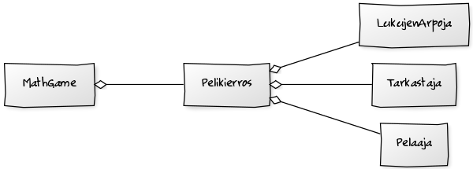

**Aihe**: Matikkapeli. Taroituksena toteuttaa yksinkertainen, mutta helposti laajennettavissa oleva matematiikkapeli. Ja koska kyseessä on "peli", täytyy siinä olla jokin päämäärä. Tämä on, että aloitellaan helpoilla ja näistä riittävän hyvin suoriutumalla pääsee suorittamaan yhä haastavampia tehtäviä (jännää!).
	Kunkin pelaajan suoritukset tallennetaan (esim. kerätyt pisteet, tähdet tai jotain muuta, millä näitä voi mitata). Tarkoitus olisi, että kukin pelaaja pääsisi "jatkamaan" siitä mihin on jäänyt, jotta aina peliin palatessa ei tarvitse käydä tasoa 1+1=2 uudelleen.

**Käyttäjät**: Kaikki, jotka haluavat testata matemaattista osaamistaan tai kenties oppia lisää huikean pelin avulla.

**Käyttäjien toiminnot**: Nimimerkin "rekisteröinti" tai sellaisen jo omaavan kirjautuminen. Itse pelissä vastaaminen eli oikean numeron/luvun syöttäminen sille varattuun "laatikkoon".
	Lisäksi pelissä tulee olemaan jonkinlainen valikko, jonka sisältö ja toiminnot ratkeavat projektin edetessä.

**Luokkakaavio**

